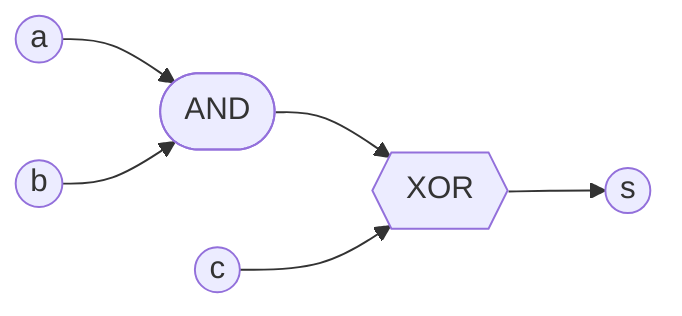
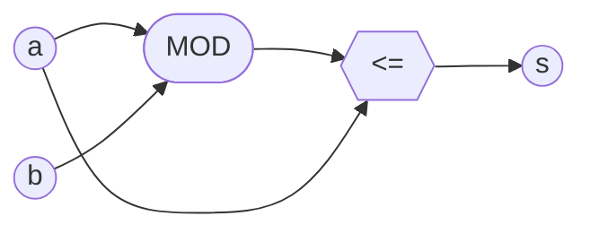
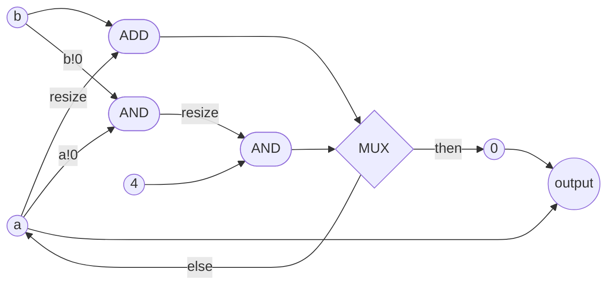

# Bit, BitVector, and BitSize

When writing hardware designs, we often want to work with raw binary. After all, it is the primitive layer of digital logic and what all of our digital designs are synthesized down to.

In this section, we introduce the basic building block of every circuit: the `Bit`. We also explore what `typeclasses` Bit implements. We then introduce probably the most common type you will use in Clash: `BitVector n`. Finally, we explain how Clash keeps track of sizes on the type level.
## What is a `Bit`
A bit is a binary value: a `high (1)` or a `low (0)`.

````admonish example title="Bit"
<!-- admonish-link href="https://example.com" text="See docs" -->
`data Bit`

A single bit

**Examples**
```
>>> high
1
>>> low
0
```
````

Okay, but how do we do things with it?

The type system in Haskell is pretty different to other languages. Without going into too much detail, one important part of any data type is what *type class instances* are defined with it. These define common functions for that data type.

A general rule of thumb is: when you want to know what something *is*, look at the data type. When you want to know *what you can do with it*, then look at 1. functions that use the type and 2. the type classes it implements.

So let's look at a few handpicked classes:

````admonish example title="Bit typeclasses"
**Notable type classes**
<details>
<summary><code>Bits Bit</code></summary>

+ <code>(.&.) :: Bit -> Bit -> Bit</code>
+ <code>(.|.) :: Bit -> Bit -> Bit</code>
+ <code>xor :: Bit -> Bit -> Bit</code>
+ <code>complement :: Bit -> Bit</code>
+ <code>shift :: Bit -> Int -> Bit</code>
+ <code>rotate :: Bit -> Int -> Bit</code>
+ <code>zeroBits :: Bit</code>
+ <code>bit :: Int -> Bit</code>
+ <code>setBit :: Bit -> Int -> Bit</code>
+ <code>clearBit :: Bit -> Int -> Bit</code>
+ <code>complementBit :: Bit -> Int -> Bit</code>
+ <code>testBit :: Bit -> Int -> Bool</code>
+ <code>bitSizeMaybe :: Bit -> Maybe Int</code>
+ <code>bitSize :: Bit -> Int</code>
+ <code>isSigned :: Bit -> Bool</code>
+ <code>shiftL :: Bit -> Int -> Bit</code>
+ <code>unsafeShiftL :: Bit -> Int -> Bit</code>
+ <code>shiftR :: Bit -> Int -> Bit</code>
+ <code>unsafeShiftR :: Bit -> Int -> Bit</code>
+ <code>rotateL :: Bit -> Int -> Bit</code>
+ <code>rotateR :: Bit -> Int -> Bit</code>
+ <code>popCount :: Bit -> Int</code>
</details>

<details>
<summary><code>Num Bit</code></summary>

+ <code>(+) :: Bit -> Bit -> Bit</code>
+ <code>(-) :: Bit -> Bit -> Bit</code>
+ <code>(*) :: Bit -> Bit -> Bit</code>
+ <code>negate :: Bit -> Bit</code>
+ <code>abs :: Bit -> Bit</code>
+ <code>signum :: Bit -> Bit</code>
+ <code>fromInteger :: Integer -> Bit</code>
</details>

<details>
<summary><code>Integral Bit</code></summary>

+ <code>quot :: Bit -> Bit -> Bit</code>
+ <code>rem :: Bit -> Bit -> Bit</code>
+ <code>div :: Bit -> Bit -> Bit</code>
+ <code>mod :: Bit -> Bit -> Bit</code>
+ <code>quotRem :: Bit -> Bit -> (Bit, Bit)</code>
+ <code>divMod :: Bit -> Bit -> (Bit, Bit)</code>
+ <code>toInteger :: Bit -> Integer</code>
</details>

<details>
<summary><code>Eq Bit</code></summary>

+ <code>(==) :: Bit -> Bit -> Bool</code>
+ <code>(/=) :: Bit -> Bit -> Bool</code>
</details>

<details>
<summary><code>Ord Bit</code></summary>

+ <code>compare :: Bit -> Bit -> Ordering</code>
+ <code>(&lt;) :: Bit -> Bit -> Bool</code>
+ <code>(&lt;=) :: Bit -> Bit -> Bool</code>
+ <code>(&gt;) :: Bit -> Bit -> Bool</code>
+ <code>(&gt;=) :: Bit -> Bit -> Bool</code>
+ <code>max :: Bit -> Bit -> Bit</code>
+ <code>min :: Bit -> Bit -> Bit</code>
</details>

<details>
<summary><code>BitPack Bit</code></summary>

+ <code>pack :: Bit -> BitVector 1</code>
+ <code>unpack :: BitVector 1 -> Bit</code>
+ <code>maybeUnpack :: BitVector 1 -> Maybe Bit</code>
</details>

````

**Examples using type classes**
```
>>> high .&. low      -- From Bits class
0
>>> xor high low        -- From Bits class
1
>>> xor high (xor high low)
0
>>> high == high        -- From Eq class
True
```

We recommend you take a minute and explore some of the type classes.

Of course, we can also define our own functions that use the `Bit` type.

```
clashi> let f a b c = xor (a .&. b) c
clashi> f high high high
0
```
**Synthesizing hardware from `Bit`**

Everything we have done so far, including applying functions, is just in Haskell. Remember, Clash code **is** Haskell code. The power of Clash is that we can also translate this code into a hardware description.

We call the process of turning Clash code into HDL **synthesis**.

We provide a few examples of Clash code below with their synthesized outputs, and we encourage you to guess before checking your answers.
<details>
<summary><strong>Example 1</strong></summary>

Input: `>>> f a = a`

Output
````admonish quote title="Synthesized output" collapsible=true


Well, that's not very interesting. The circuit simply passes the input through to the output.
````
</details>
<details>
<summary><strong>Example 2</strong></summary>

Input: `let f a b c = xor (a .&. b) c`

Output
````admonish quote title="Synthesized output" collapsible=true

````
</details>
<details>
<summary><strong>Example 3</strong></summary>

Input:
```
let f a b = c
  where
   c = (a .|. b) .|. c
```

**Output**
````admonish quote title="Synthesized output" collapsible=true
Congrats, you created your first combinational loop in Clash!

This one will not actually compile in Clash.
````
</details>

**Conclusion**

In all honesty, while `Bit` is an important data type, you don't end up using it a lot in Clash. This is because you will often work with collections of wires, which is represented in Clash as `BitVector n`.

## What is a `BitVector n`
Typically, it's useful to represent a collection of bit together. A `BitVector n` is a vector of `n` bits.


```admonish example title="BitVector"
`data BitVector (n :: Nat)`

A vector of `n` bits, where `n` is defined on the type level

* Bit indices are descending
* Num instance performs unsigned arithmetic.

**Instances:**

<details>
<summary><code>Bits (BitVector n)</code></summary>

+ <code>(.&.) :: BitVector n -> BitVector n -> BitVector n</code>
+ <code>(.|.) :: BitVector n -> BitVector n -> BitVector n</code>
+ <code>xor :: BitVector n -> BitVector n -> BitVector n</code>
+ <code>complement :: BitVector n -> BitVector n</code>
+ <code>shift :: BitVector n -> Int -> BitVector n</code>
+ <code>rotate :: BitVector n -> Int -> BitVector n</code>
+ <code>zeroBits :: BitVector n</code>
+ <code>bit :: Int -> BitVector n</code>
+ <code>setBit :: BitVector n -> Int -> BitVector n</code>
+ <code>clearBit :: BitVector n -> Int -> BitVector n</code>
+ <code>complementBit :: BitVector n -> Int -> BitVector n</code>
+ <code>testBit :: BitVector n -> Int -> Bool</code>
+ <code>bitSizeMaybe :: BitVector n -> Maybe Int</code>
+ <code>bitSize :: BitVector n -> Int</code>
+ <code>isSigned :: BitVector n -> Bool</code>
+ <code>shiftL :: BitVector n -> Int -> BitVector n</code>
+ <code>unsafeShiftL :: BitVector n -> Int -> BitVector n</code>
+ <code>shiftR :: BitVector n -> Int -> BitVector n</code>
+ <code>unsafeShiftR :: BitVector n -> Int -> BitVector n</code>
+ <code>rotateL :: BitVector n -> Int -> BitVector n</code>
+ <code>rotateR :: BitVector n -> Int -> BitVector n</code>
+ <code>popCount :: BitVector n -> Int</code>
</details>

<details>
<summary><code>Num (BitVector n)</code></summary>

+ <code>(+) :: BitVector n -> BitVector n -> BitVector n</code>
+ <code>(-) :: BitVector n -> BitVector n -> BitVector n</code>
+ <code>(*) :: BitVector n -> BitVector n -> BitVector n</code>
+ <code>negate :: BitVector n -> BitVector n</code>
+ <code>abs :: BitVector n -> BitVector n</code>
+ <code>signum :: BitVector n -> BitVector n</code>
+ <code>fromInteger :: Integer -> BitVector n</code>
</details>

<details>
<summary><code>Integral (BitVector n)</code></summary>

+ <code>quot :: BitVector n -> BitVector n -> BitVector n</code>
+ <code>rem :: BitVector n -> BitVector n -> BitVector n</code>
+ <code>div :: BitVector n -> BitVector n -> BitVector n</code>
+ <code>mod :: BitVector n -> BitVector n -> BitVector n</code>
+ <code>quotRem :: BitVector n -> BitVector n -> (BitVector n, BitVector n)</code>
+ <code>divMod :: BitVector n -> BitVector n -> (BitVector n, BitVector n)</code>
+ <code>toInteger :: BitVector n -> Integer</code>
</details>

<details>
<summary><code>Eq (BitVector n)</code></summary>

+ <code>(==) :: BitVector n -> BitVector n -> Bool</code>
+ <code>(/=) :: BitVector n -> BitVector n -> Bool</code>
</details>

<details>
<summary><code>Ord (BitVector n)</code></summary>

+ <code>compare :: BitVector n -> BitVector n -> Ordering</code>
+ <code>(&lt;) :: BitVector n -> BitVector n -> Bool</code>
+ <code>(&lt;=) :: BitVector n -> BitVector n -> Bool</code>
+ <code>(&gt;) :: BitVector n -> BitVector n -> Bool</code>
+ <code>(&gt;=) :: BitVector n -> BitVector n -> Bool</code>
+ <code>max :: BitVector n -> BitVector n -> BitVector n</code>
+ <code>min :: BitVector n -> BitVector n -> BitVector n</code>
</details>

<details>
<summary><code>BitPack (BitVector n)</code></summary>

+ <code>pack :: BitVector n -> BitVector n</code>
+ <code>unpack :: BitVector n -> BitVector n</code>
+ <code>maybeUnpack :: BitVector n -> Maybe (BitVector n)</code>
</details>

<details>
<summary><code>Resize BitVector</code></summary>

+ <code>resize :: BitVector a -> BitVector b</code>
+ <code>extend :: BitVector a -> BitVector (b + a)</code>
+ <code>zeroExtend :: BitVector a -> BitVector (b + a)</code>
+ <code>signExtend :: BitVector a -> BitVector (b + a)</code>
+ <code>truncateB :: BitVector (a + b) -> BitVector a</code>
</details>

```

Let's take a look at a few examples to build up an intuition.

**Examples:**
```
>>> 3 :: BitVector 8
0b0000_0011
>>> 3 :: BitVector 16
0b0000_0000_0000_0011
>>> 3 :: BitVector 1
0b1
```

Pretty straightforward, right?

Similar to `Bit`, we can use any of the methods defined in the `typeclasses` that `BitVector` implements, along with other functions the `Clash.Prelude` library exports.

```
>>> let x = 3 :: BitVector 8
>>> let y = 4 :: BitVector 8
>>> x + y                        -- Uses Num
7
>>> let f a b = (mod a b) <= a   -- Uses Integral, Ord
>>> f x y
True
>>> resize x :: BitVector 16    -- Uses Resize
7
```

**Type level sizing**

One important part of the `BitVector n` definition is that
> "`n` is defined on the type level".

This means that when you declare a type (or Clash infers a type), the size `n` of the `BitVector n` is part of the type. Which means if Clash is expecting a certain sized BitVector and you give it something else, it will throw a type error.

```
>>> let x = 3 :: BitVector 8
>>> let y = 4 :: BitVector 9
>>> x + y
<interactive>:86:5: error: [GHC-83865]
    • Couldn't match type ‘9’ with ‘8’
      Expected: BitVector 8
        Actual: BitVector 9
    • In the second argument of ‘(+)’, namely ‘y’
      In the expression: x + y
      In an equation for ‘it’: it = x + y
>>> let resized_y = resize y :: BitVector 8
>>> x + y
7
```

```admonish warning title="Different from Verilog/VHDL"
This is one place Clash differs from Verilog/VHDL. Verilog and VHDL will `0`-extend different width numbers to make them match. Clash will throw a type error and force the designer to explicitly handle the conversion (perhaps through `resize`) or use a different function.

One of Haskell's guiding principles, which Clash inherits, is that a strong type system reduces bugs and increases correctness.
```

**Synthesizing hardware for `BitVector n`**

<details>
<summary><strong>Example 1</strong></summary>

Input:
```
f :: BitVector 3 -> BitVector 3
f a = a
```

Output
````admonish quote title="Synthesized output" collapsible=true


It's the exact same as the `Bit` version of the same function, except with three wires instead of one.
````
</details>
<details>
<summary><strong>Example 2</strong></summary>

Input:
```
f :: BitVector 3 -> BitVector 3 -> BitVector 3
f a b = (mod a b) <= a
```

Output
````admonish quote title="Synthesized output" collapsible=true


`a` and `b` (each a 3-bit bus) feed the `MOD` block; `a` is also routed straight through to the comparator, since it's used a second time in `(mod a b) <= a`. The comparator's result is a single-bit `Bool`, so the output is drawn as one wire rather than a 3-wire bus.
````
</details>

<details>
<summary><strong>Example 3</strong></summary>

Input:
```
f :: BitVector 3 -> BitVector 5 -> BitVector 3
f a b = output
 where
  c = (resize a) + b
  d = a !! 0 .&. b !! 0
  output =
    if (c > (4 :: BitVector 5) .&. d)
        then 0
        else a
```

Output
````admonish quote title="Synthesized output" collapsible=true

````
</details>

**Conclusion**

`BitVector n` is ubiquitous in Clash code. However, we often times want to represent values not as a bundle of wires, but at a higher level of abstraction. In the next section, we'll look at how Clash handles numbers.

But before that, a _quiz_:

{{#quiz ./quizzes/bitvector.toml}}