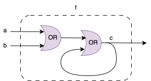

# Common pitfall: Combinational loops

```admonish bug title="Combinational loop"
Pitfall symptoms:
- A Clash circuit never terminates in simulation (CPU usage will also be 0)
- If you try and synthesize the circuit to hardware, your tool says "hey, you have a combinational loop"
```

A combinational loop is when the output of a circuit loops back and influences its own input. We have already seen a combinational loop in the `Bit, BitVector` section.



Combinational loops are the bane of any new hardware designer. Aas old as hardware itself. As such, we won't go into an explanation of what combinational loops are. But we will cover a few details on how they appear in Clash, so that you know what to be on the lookout for.

**Surprising combinational loop**

In our `Bit, BitVector` section, we introduced a circuit that has a combinational loop

```
let f a b = c
  where
   c = (a .|. b) .|. c
```

It's useful to understand how this is a combinational loop, since it actually seems to be well-defined from a boolean logic perspective.