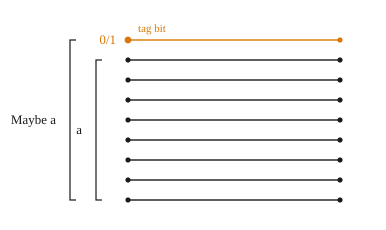

# Maybe
So far, we have looked at relatively low-level data types: bitvectors, numbers, etc. However, we can also define richer data types and Clash can synthesize them into hardware.

In this section, we look at an example of such a data type: `Maybe a`. Two sections later, we will generalize this structure and look at how Clash can instantiate any statically sized data type into hardware generally.

## Maybe a

In Clash, `Maybe a` is often used to represent data that may or may not be present. In hardware, `Maybe a` is represented by `1` bit that can be considered a "valid" or "tag" bit, plus the bits required to represent `a`.

````admonish example title="Maybe a"
<!-- admonish-link href="https://hackage.haskell.org/package/base/docs/Data-Maybe.html#t:Maybe" text="See doc on Hackage >" -->
`data Maybe a`

The Maybe type encapsulates an optional value. A value of type `Maybe a` either contains a value of type `a` (represented as `Just a`), or it is empty (represented as `Nothing`). Using Maybe is a good way to deal with errors or exceptional cases without resorting to drastic measures such as error.

**Constructors**

* `Nothing`	 
* `Just a`
````


`Maybe` is an example of a parametric type. A parametric type takes in another type as part of its type signature. So these are all unique types:
```
Maybe Bool         -- Values are: Nothing, Just False, Just True
Maybe (Unsigned 8) -- Values are: Nothing, Just 0, Just 1, ..., Just 255
```

**Representation in hardware**

We can use `pack` from the `BitPack` class to see how Clash represents various values as `BitVector`s:

```
>>> pack (Just True)
0b11
>>> pack (Just (3 :: BitVector 8))
0b1_0000_0011
>>> pack (Nothing :: Maybe Bool)
0b0.
>>> pack (Nothing :: Maybe (BitVector 8))
0b0_...._....
```

In practice, the bit representation of `Maybe a` generalizes as such:
````admonish quote title="Synthesized output" collapsible=true

````

When this valid bit is `0`, Clash makes no guarantee what the other bits are.
- In software, this is represented by `undefined` internally, or a `.` in the output.
- In hardware, the wire can be any value (and is determined by whatever results in the smallest output circuit)

````admonish warning title="<code>undefined</code> values in Haskell"
`undefined` is a special value in Haskell. It does the same job as `null` or `Nil` in other languages (for those language-inclined, its a bottom value). Haskell does not mind something being `undefined` _until you try to evaluate it_.

For example, we can see that a value is undefined, but when we try to get its value, Haskell throws an error
```
>>> let x = pack (Nothing :: Maybe (BitVector 8))
>>> x
0b0_...._....
>>> bitToBool(x !! 3)
error
```

This type of error can only be caught at runtime. Luckily, you would rarely write this logic in practice. You would use [pattern-matching]() to safely access the bits, which we cover in a later section.

````


**Examples**

Here's an example of `Maybe` in action: when we convert a signed to an unsigned number, we return `Just num` when the number is able to be represented losslessly; otherwise, we return `Nothing`.

```
>>> myFunc :: Signed 8 -> Maybe (Unsigned 8)
>>> myFunc num = if (num < 0)
    then Nothing
    else (Just (bitCoerce num))
```

Here's a second example, checking to see if two numbers are above a threshold. If they are, return the sum, otherwise return `Nothing`.

```
>>> myFunc :: Unsigned 8 -> Unsigned 8 -> Maybe (Unsigned 9)
>>> myFunc num1 num2 = if (total > 5)
    then (Just total)
    else Nothing
 where
  total = (resize num1) + (resize num2)
```

In both examples, we could have instead opted to encode a non-value as a default value (such as `0`). However, because there is nothing to distinguish between a default value and an actual value, we could later forget. Instead, because we represent this information in the type, Clash will not allow our program to typecheck unless we explicitly handle the case where the value is `Nothing`.

**Conclusion**

`Maybe` is often used in sequential logic, to indicate a value may be present on some cycles but not others. We will cover sequential logic in a later chapter.
