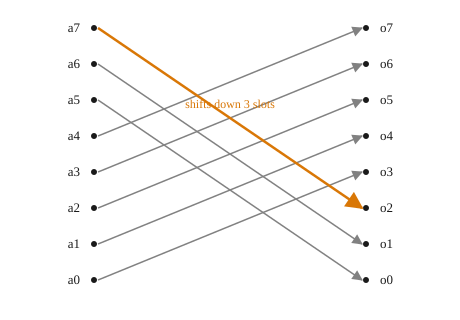

# Common pitfall: static vs dynamic operations

Pitfall type: your synthesized circuit is a lot larger than it should be.

**Difference between static and dynamic operations**

It's worth discussing the difference between static and dynamic operations.

Static operations are operations where you know at compile time one or more of the parameters. For example, for `rotateLeftS`, you know at compile time how much you'd like to rotate by. This could be a compile-time constant or equation of compile-time constants. For example,

```
-- Rotate vec by 3, where 3 is known at compile time
rotateLeftS vec d3

-- Rotate vec by half it's length. Since vecs have known lengths at compile time, the
-- compiler can calculate this down to a compile-time constant
rotateByHalf vec = rotateLeftS vec (SNat @(n `Div` 2))
rotateByHalf (3 :> 4 :> 5 :> Nil :: Vec 3 (Unsigned 4))
```

Because the rotation amount is known at compile time, `rotateLeftS` doesn't synthesize any logic for it at all -- it just relabels which output wire each input bit connects to. Rotating a `BitVector 8` by 3 is the exact same circuit as no rotation, just wired differently:

```admonish quote title="Synthesized static rotation" collapsible=true

```

There's no comparator, no multiplexer, nothing that costs a gate or a clock cycle -- it's pure wiring, which is why static operations are effectively free.

Dynamic rotations is when the amount you'd like to rotate by is determined by another part of your circuit being executed. Dynamic operations are less efficient, because the Clash compiler needs to synthesize circuitry for each possible value.

```
myRotateLeft :: Vec 8 a -> Unsigned 3 -> Vec 8 a
myRotateLeft vec r = rotateLeft vec r
```

```admonish quote title="Synthesized dynamic rotation" collapsible=true

```

Note, you can still use a dynamic rotation with a constant

```
rotateLeft vec 3 -- Compiles perfectly fine
```

Clash will NOT automatically convert this to a static rotation. However, downstream synthesis tools _may_ detect this and optimize it to a static rotation. When in doubt, it's best to use an explicit static rotation.