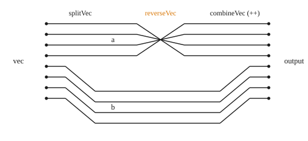

# Vec, Tuples

We often want to work with collections of things. Clash offers two main ways to do this: `Vec`s and tuples (denoted by `(,)`).

When deciding whether to use `Vec` or tuple:
* If the collection needs to be of multiple types, use a tuple
* Otherwise, use a `Vec`, as they tend to be easier to work with

## Vec n a
Haskell programs often use Lists to represent ordered collections of elements. However, Lists are dynamically-sized and unknown size at compile time. They can even be infinite size in Haskell!

Clash datatypes, since they're just Haskell data types, work perfectly fine with lists when running as a program:

```
>>> let x = [3, 4, 5] :: [BitVector 8]    -- This is a list
```

This property is useful for writing tests. However, Clash cannot **synthesize** them into hardware.

To take the place of lists, Clash introduces `Vec n a`, which operates similarly to a list but always has a statically defined size.

````admonish example title="Vec n a"
`data Vec :: Nat -> Type -> Type where`

Fixed size vectors.

* Lists with their length encoded in their type
* Vector elements have an ASCENDING subscript starting from `0` and ending at `length - 1`.

Constructors

* `Nil :: Vec 0 a`
* `Cons :: a -> Vec n a -> Vec (n + 1) a`


**Examples:**
```
>>> let x = 3 :> 4 :> 5 :> Nil :: Vec 3 (BitVector 8)
>>> x
0b0000_0011 :> 0b0000_0100 :> 0b0000_0101 :> Nil
>>> x !! 0
0b0000_0011
clashi> x !! 3
*** Exception: Clash.Sized.Vector.(!!): index 3 is larger than maximum index 2
```
````

You may notice two main things about Vecs:
* All elements are of the same type (identical to lists)
* The size of the vector is always statically known (or able to be inferred)

Note, due to Haskell's type inference, the size of the vector must be known at compile time, it does not need to be explicitly annotated.

```
f :: Vec 3 Bool -> Vec 5 Bool
f v = final_v
 where
   intermediate_v = (singleton False) ++ v
   final_v = (singleton True) ++ intermediate_v
```

In the above example, the Haskell typechecker can infer that `intermediate_v` is of type `Vec 4 Bool`, even though we never explicitly declare it.

**Functions on Vectors**

While normally we'd walk you through some of the common Vector functions, there are enough of them that we will just list them below. There are more functions available than we list, but we cover the ones you will most likely use when starting with Clash. Each function has an example included showing how they work.

````admonish example title="Creating"

We can create them literally

`x = 3 :> 4 :> 5 :> Nil`

or use one of the following functions

<details>
<summary><code class="language-haskell">singleton :: a -> Vec 1 a</code></summary>
</details>
<details>
<summary><code class="language-haskell">replicate :: SNat n -> a -> Vec n a </code></summary>
</details>
<details>
<summary><code class="language-haskell">repeat :: KnownNat n => a -> Vec n a </code></summary>
</details>
<details>
<summary><code class="language-haskell">iterate :: SNat n -> (a -> a) -> a -> Vec n a </code></summary>
</details>

````

````admonish example title="Getting individual elements"
<details>
<summary><code class="language-haskell">head :: Vec (n + 1) a -> a </code></summary>
</details>
<details>
<summary><code class="language-haskell">last :: Vec (n + 1) a -> a </code></summary>
</details>
<details>
<summary><code class="language-haskell">(!!) :: (KnownNat n, Enum i) => Vec n a -> i -> a </code></summary>
</details>
````

````admonish example title="Getting subvectors"
<details>
<summary><code class="language-haskell">init :: Vec (n + 1) a -> Vec n a </code></summary>
</details>
<details>
<summary><code class="language-haskell">tail :: Vec (n + 1) a -> Vec n a </code></summary>
</details>
<details>
<summary><code class="language-haskell">take :: SNat m -> Vec (m + n) a -> Vec m a </code></summary>
</details>
<details>
<summary><code class="language-haskell">drop :: SNat m -> Vec (m + n) a -> Vec n a </code></summary>
</details>
<details>
<summary><code class="language-haskell">splitAt :: SNat m -> Vec (m + n) a -> (Vec m a, Vec n a) </code></summary>
</details>
````

````admonish example title="Combining vectors"
<details>
<summary><code class="language-haskell">(++) :: Vec n a -> Vec m a -> Vec (n + m) a </code></summary>
</details>
<details>
<summary><code class="language-haskell">merge :: Vec n a -> Vec n a -> Vec (2 * n) a </code></summary>
</details>

<details>
<summary><code class="language-haskell">shiftInAt0 :: KnownNat n => Vec n a -> Vec m a -> (Vec n a, Vec m a)</code></summary>
</details>
````

````admonish example title="Manipulating vectors"
<details>
<summary><code class="language-haskell">(+>>) :: forall n a. a -> Vec n a -> Vec n a </code></summary>
</details>
<details>
<summary><code class="language-haskell">(<<+) :: Vec n a -> a -> Vec n a </code></summary>
</details>
<details>
<summary><code class="language-haskell">replace :: (KnownNat n, Enum i) => i -> a -> Vec n a -> Vec n a </code></summary>
</details>
<details>
<summary><code class="language-haskell">reverse :: Vec n a -> Vec n a </code></summary>
</details>
<details>
<summary><code class="language-haskell">rotateLeft :: (Enum i, KnownNat n) => Vec n a -> i -> Vec n a </code></summary>
</details>
<details>
<summary><code class="language-haskell">rotateLeftS :: KnownNat n => Vec n a -> SNat d -> Vec n a </code></summary>
</details>
<details>
<summary><code class="language-haskell">rotateRight :: (Enum i, KnownNat n) => Vec n a -> i -> Vec n a </code></summary>
</details>
<details>
<summary><code class="language-haskell">rotateRightS :: KnownNat n => Vec n a -> SNat d -> Vec n a </code></summary>
</details>
````

````admonish example title="Functions over elements"
See the [Map, Zip, Fold](./map.md) section
````

````admonish example title="Conversions"
<details>
<summary><code class="language-haskell">toList :: Vec n a -> [a] </code></summary>
</details>
<details>
<summary><code class="language-haskell">fromList :: forall n a. KnownNat n => [a] -> Maybe (Vec n a) </code></summary>
</details>
````


## Tuples
We may want to work with collections containing multiple types of elements. Since the type signature of `Vec n a` requires all elements to be of the same type (`a`), we cannot use them. Tuples are the standard way of doing so.

````admonish example title="Tuples"
```
(a, b)              -- a 2-tuple
(a, b, c)           -- a 3-tuple
(a, b, c, d)        -- ...
(a, b, c, d, ...)
```

**Common functions**

<details>
<summary><code class="language-haskell">pair :: a -> b -> (a, b)</code></summary>
</details>
<details>
<summary><code class="language-haskell">first :: (a, b) -> a</code></summary>
</details>
<details>
<summary><code class="language-haskell">second :: (a, b) -> b</code></summary>
</details>
<details>
<summary><code class="language-haskell">mapFirst :: (a -> x) -> (a, b) -> (x, b)</code></summary>
</details>
<details>
<summary><code class="language-haskell">mapSecond :: (b -> y) -> (a, b) -> (a, y) </code></summary>
</details>


**Examples**
```
>>> let x = (True, False)
>>> let y = (True, 0 :: Unsigned 8)
>>> let z = (3 :: Unsigned 4, (4 :: Signed 4, True))   -- We can nest tuples
```
````


Often times, it's useful to group values together. Since Haskell only allows one return type for a function, tuples are often used when we want to return multiple values from a function.

Example type signature from `Integral` typeclass:
```
quotRem :: Bit -> Bit -> (Bit, Bit) 
```

Example type signature from `Counter` typeclass:
```
countSuccOverflow :: Bit -> (Bool, Bit) 
```

**Synthesis**

Tuples can be synthesized in Clash as long as the internal values are of known size. To see what this looks like, we show an example below

```
splitVec :: BitVector 8 -> (BitVector 4, BitVector 4)
splitVec vec = splitAt d4 vec

reverseVec :: BitVector 4 -> BitVector 4
reverseVec vec = reverse vec

combineVec :: BitVector 4 -> BitVector 4 -> BitVector 8
combineVec vec1 vec2 = vec1 ++ vec2

myFunction :: BitVector 8 -> BitVector 8
myFunction vec = combineVec (reverseVec a) b
 where
  (a, b) = splitVec vec
```
````admonish quote title="Synthesized output" collapsible=true

````
