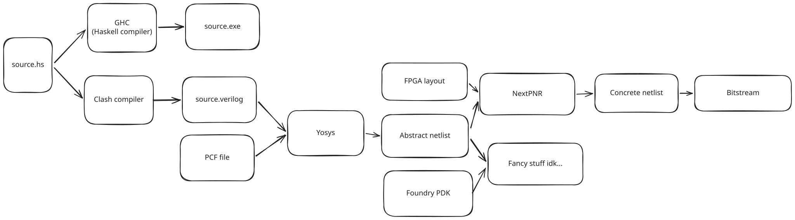

# How to set up and run Clash

We provide a number of examples of Clash code and the synthesized output in this book. However, nothing beats the feedback loop of the reader modifying some of the examples (or coming up with entirely new ones) and seeing the change in type-checking/compilation/synthesis themselves. A worker should never be afraid of their tools - they're there to help.

## Setting up Clash

That being said, Haskell (and by extension Clash) has a number of setup configuration options that may confuse new users. To work around this, the Clash team offers a [getting started](https://github.com/clash-lang/clash-starters) repository with sensible defaults.

**The Clash to FPGA pipeline**



## Compiling with Clash

The Clash compiler is a binary executable. You can run Clash two ways
- Download a specific version and execute it (easier to get started)
    - `clash <module> <flags>`
- Build a local, per-project clash executable and run it (recommended in the long run)
    - `cabal run clash <module> -- <flags>`

**Declaring your entrypoint**

Clash expects one function to define the entrypoint of the hardware design to be synthesized. In hardware, we call this the _topEntity_ (the software analogy is the _main_ function).

When compiling with Clash, you must specify the name of a module for Clash to look for the entrypoint.

There are a few ways of declaring a function as the entrypoint:
- The function name can be passed explicitly to Clash via the `-main-is` flag
- The function can be named `topEntity`
- The function name can be declared with a `Synthesize` pragma (more on this later)

If the entrypoint is ambiguous, Clash will throw an error.

**Customizing the names of your output circuit/wires**

If you use the first two options, your input/output wires will be named identically to your argument names. Meaning
```
topEntity
  :: Clock DomInput
  -> Reset DomInput
  -> Enable Dom50
  -> Signal Dom50 Bit
  -> Signal Dom50 (BitVector 8)
topEntity clk20 rstBtn enaBtn modeBtn = ...
```
will result in port names `clk20`, `rstBtn`, `enaBtn`, etc.

The third option, a `Synthesize` pragma, lets you control the naming of your output code.

```
{-# ANN topEntity
  (Synthesize
    { t_name   = "blinker"
    , t_inputs = [ PortName "CLOCK_50", PortName "KEY0", PortName "KEY1", PortName "KEY2" ]
    , t_output = PortName "LED"
    }) #-}
```