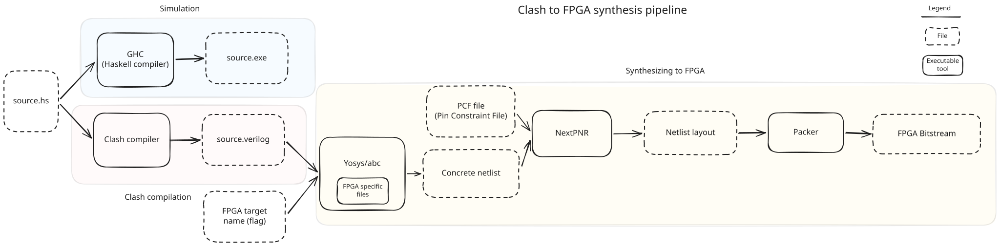

# How to set up and run Clash

We provide a number of examples of Clash code and the synthesized output in this book. However, nothing beats the feedback loop of the reader modifying some of the examples (or coming up with entirely new ones) and seeing the change in type-checking/compilation/synthesis themselves.

## Where Clash fits in the hardware pipeline

There are two main end targets for a Clash (or any other hardware) design: FPGA or ASIC. We will focus on FPGAs throughout this book. FPGAs are cheaper, easier, and faster deployment targets than ASICs. Clash works equally well for ASICs, but we pick one pipeline for simplicity.

**The Clash to FPGA pipeline**



## Setting up the Clash compiler

The Clash compiler is a binary executable that takes in Clash code and outputs Verilog/VHDL code. You can either download a pre-built Clash binary or build one from source.

There are two ways of setting up Clash:
- (Beginner) Globally (by updating `PATH`) and then invoke as a regular binary
    - Pros: Easier to get started
    - Cons: You can only have one version of Clash at a time. If you want to compile multiple projects with different Clash versions, too bad.
    - Example invocation: `clash <module> <flags>`
- (Advanced) Build Clash from source as a target within your Clash project
    - Pros: Ensures each project uses a Clash executable compiled with the same version as your code
    - Cons: Uses more storage on your computer
    - Example invocation: `cabal run clash <module> -- <flags>`

The Clash starter project (which we discuss next) uses the second option. Since this option is already set up for you, you simply need to run the invocation `cabal run clash <module> -- <flags>` inside the project.

## Setting up a Clash project

Haskell (and by extension Clash) has a number of setup configuration options that may confuse new users. To work around this, the Clash team offers a [getting started](https://github.com/clash-lang/clash-starters) repository with sensible defaults.

If you are interested in understanding a Clash project structure, we recommend the section on [Cabal and Hackage](../appendix/introduction_to_cabal.md).


**Declaring your entrypoint**

Clash expects one function to define the entrypoint of the hardware design to be synthesized. In hardware, we call this the _topEntity_ (the software analogy is the _main_ function).

When compiling with Clash, you must specify the name of a module for Clash to look for the entrypoint.

There are a few ways of declaring a function as the entrypoint:
- The function name can be passed explicitly to Clash via the `-main-is` flag
- The function can be named `topEntity`
- The function name can be declared with a `Synthesize` pragma (more on this later)

If the entrypoint is ambiguous, Clash will throw an error.

**Customizing the names of your output circuit/wires**

If you use the first two options, your input/output wires will be named identically to your argument names. Meaning
```
topEntity
  :: Clock DomInput
  -> Reset DomInput
  -> Enable Dom50
  -> Signal Dom50 Bit
  -> Signal Dom50 (BitVector 8)
topEntity clk20 rstBtn enaBtn modeBtn = ...
```
will result in port names `clk20`, `rstBtn`, `enaBtn`, etc.

The third option, a `Synthesize` pragma, lets you control the naming of your output code.

```
{-# ANN topEntity
  (Synthesize
    { t_name   = "blinker"
    , t_inputs = [ PortName "CLOCK_50", PortName "KEY0", PortName "KEY1", PortName "KEY2" ]
    , t_output = PortName "LED"
    }) #-}
```


## Compiling with Clash
To compile your Clash design, simply run the Clash compiler. The following flags may be useful

```
# Which HDL language to output
--vhdl
--verilog
--systemverilog

# (optional) Where to put the output
-fclash-hdldir=DIR
```

## Synthesizing to a FPGA
Now that you have your hardware design in Verilog/VHDL, you can use any number of tools to synthesize the design and upload to an FPGA. We recommend Yosys and the [oss-cad-suite](https://github.com/YosysHQ/oss-cad-suite-build), but many options are available.