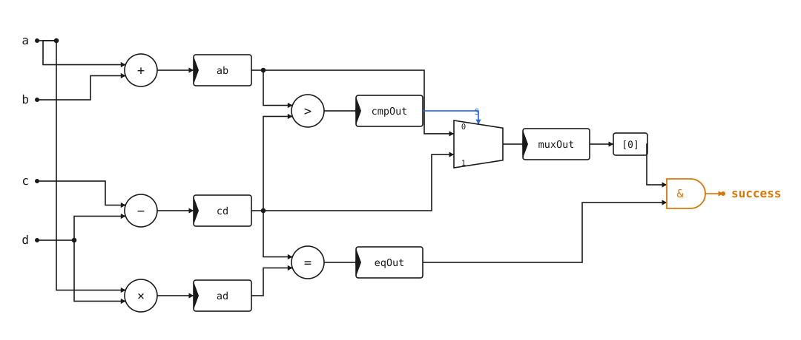

# What is a HDL?

A HDL (Hardware Description Language) is a language that describes how circuits exist and compose together. Broadly, it describes a graph of hardware components.

```admonish warning
If you come from the software world, you are used to languages creating graphs of execution that execute over _time_. In hardware, the graphs of execution we create will execute over _space_ (and technically still over time, but in a very different way from software).
```

To help build an intuition, here's an example of a circuit graph



_(Note: This circuit graph is a puzzle! See if you can find a set of inputs that causes `success` to go high.)_

Unlike software, these hardware graphs are inherently parallel. This means we need different ways of expressing logic than in software.

A HDL formalizes how we describe these graphs.

Here is the above diagram as written in different HDLs. The first two languages, Verilog and VHDL, are the standard languages for the chip design industry. The third language, Clash, is the subject of this book. The fourth language, Chisel, is another new HDL that has seen reasonable adoption in the industry, including by companies such as SiFive.

<!-- tabs: Verilog | VHDL | Clash | Chisel -->
```verilog
module my_func (
  input  wire       clk,
  input  wire       rst,
  input  wire [3:0] a,
  input  wire [3:0] b,
  input  wire [3:0] c,
  input  wire [3:0] d,
  output wire       success
);

  reg [3:0] ab, cd, ad;
  reg       cmp_out, eq_out;
  reg [3:0] mux_out;

  always @(posedge clk) begin
    if (rst) begin
      ab      <= 4'd0;
      cd      <= 4'd0;
      ad      <= 4'd0;
      cmp_out <= 1'b0;
      mux_out <= 4'd0;
      eq_out  <= 1'b0;
    end else begin
      ab      <= a + b;
      cd      <= c - d;
      ad      <= a * d;
      cmp_out <= (ab > cd);
      mux_out <= cmp_out ? ab : cd;
      eq_out  <= (ad == cd);
    end
  end

  assign success = eq_out & mux_out[0];

endmodule
```
```vhdl
library ieee;
use ieee.std_logic_1164.all;
use ieee.numeric_std.all;

entity my_func is
  port (
    clk        : in  std_logic;
    rst        : in  std_logic;
    a, b, c, d : in  unsigned(3 downto 0);
    success    : out std_logic
  );
end entity;

architecture rtl of my_func is
  signal ab, cd, ad       : unsigned(3 downto 0) := (others => '0');
  signal mux_out          : unsigned(3 downto 0) := (others => '0');
  signal cmp_out, eq_out  : std_logic := '0';
begin
  process (clk)
  begin
    if rising_edge(clk) then
      if rst = '1' then
        ab      <= (others => '0');
        cd      <= (others => '0');
        ad      <= (others => '0');
        cmp_out <= '0';
        mux_out <= (others => '0');
        eq_out  <= '0';
      else
        ab      <= a + b;
        cd      <= c - d;
        ad      <= resize(a * d, ad'length);
        cmp_out <= '1' when ab > cd else '0';
        mux_out <= ab when cmp_out = '1' else cd;
        eq_out  <= '1' when ad = cd else '0';
      end if;
    end if;
  end process;

  success <= eq_out and mux_out(0);
end architecture;
```
```haskell
myFunc ::
  HiddenClockResetEnable dom =>
  Signal dom (BitVector 4) ->
  Signal dom (BitVector 4) ->
  Signal dom (BitVector 4) ->
  Signal dom (BitVector 4) ->
  Signal dom Bit
myFunc a b c d = success
 where
   ab = register 0 (a + b)
   cd = register 0 (c - d)
   ad = register 0 (a * d)

   cmpOut = register False (ab .>. cd)
   muxOut = register 0 (mux cmpOut ab cd)
   eqOut = register 0 (boolToBit (ad .==. cd))

   success = eqOut .&. muxOut !! 0
```
```scala
import chisel3._

class MyFunc extends Module {
  val io = IO(new Bundle {
    val a       = Input(UInt(4.W))
    val b       = Input(UInt(4.W))
    val c       = Input(UInt(4.W))
    val d       = Input(UInt(4.W))
    val success = Output(Bool())
  })

  val ab = RegNext(io.a + io.b, 0.U(4.W))
  val cd = RegNext(io.c - io.d, 0.U(4.W))
  val ad = RegNext((io.a * io.d)(3, 0), 0.U(4.W))

  val cmpOut = RegNext(ab > cd, false.B)
  val muxOut = RegNext(Mux(cmpOut, ab, cd), 0.U(4.W))
  val eqOut  = RegNext(ad === cd, false.B)

  io.success := eqOut & muxOut(0)
}
```

**Conclusion**

There are MANY more things to say about HDLs. Topics include:
* HDL vs HLS
* RTL and other layers of abstraction
* The history of functional languages in HDLs (and other approaches)

We defer those topics to later sections in the book. In the meantime, I'd recommend the following [Asianometry video](https://www.youtube.com/watch?v=AUm08ZUD63Q) on the history of (the accidental creation of) HDLs.

Onwards!