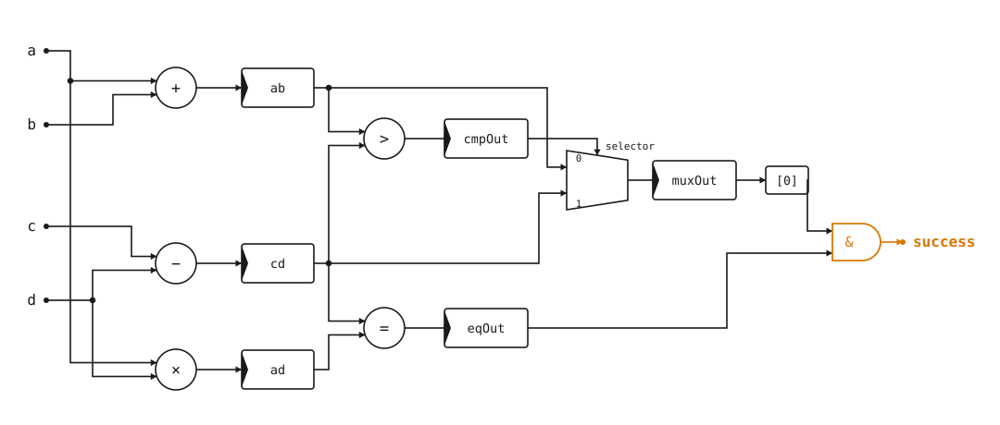

# What is a HDL?

A HDL (Hardware Description Language) is a language that describes how digital circuits exist and compose together.

If you come from the software world like I did, you are used to languages creating graphs of execution that execute over _time_. In hardware, the graphs of execution we create will execute over _space_ and the time it takes electricity to propagate through this space (this is not entirely true, we will circle back to time in Chapter 3: Sequential logic). A HDL formalizes how we describe these graphs.

To help build a visual intuition, here's an example circuit graph



_(Note: This circuit graph is a puzzle! See if you can find a set of inputs that causes `success` to go high.)_

Unlike software, these hardware graphs are inherently parallel. For example, the operations between `a,b`, `c,d`, and `a,d` all happen simultaneously. This means hardware needs different language constructs than software.

**HDL examples**

Here is the above diagram as written in different HDLs. The first two languages, Verilog and VHDL, are the standard languages for the chip design industry. The third language, Clash, is the subject of this book. The fourth language, Chisel, is another new HDL that has seen reasonable adoption in the industry, including by companies such as SiFive.

<!-- tabs: Verilog | VHDL | Clash | Chisel -->
```verilog
module my_func (
  input  wire       clk,
  input  wire       rst,
  input  wire [3:0] a,
  input  wire [3:0] b,
  input  wire [3:0] c,
  input  wire [3:0] d,
  output wire       success
);

  reg [3:0] ab, cd, ad;
  reg       cmp_out, eq_out;
  reg [3:0] mux_out;

  always @(posedge clk) begin
    if (rst) begin
      ab      <= 4'd0;
      cd      <= 4'd0;
      ad      <= 4'd0;
      cmp_out <= 1'b0;
      mux_out <= 4'd0;
      eq_out  <= 1'b0;
    end else begin
      ab      <= a + b;
      cd      <= c - d;
      ad      <= a * d;
      cmp_out <= (ab > cd);
      mux_out <= cmp_out ? ab : cd;
      eq_out  <= (ad == cd);
    end
  end

  assign success = eq_out & mux_out[0];

endmodule
```
```vhdl
library ieee;
use ieee.std_logic_1164.all;
use ieee.numeric_std.all;

entity my_func is
  port (
    clk        : in  std_logic;
    rst        : in  std_logic;
    a, b, c, d : in  unsigned(3 downto 0);
    success    : out std_logic
  );
end entity;

architecture rtl of my_func is
  signal ab, cd, ad       : unsigned(3 downto 0) := (others => '0');
  signal mux_out          : unsigned(3 downto 0) := (others => '0');
  signal cmp_out, eq_out  : std_logic := '0';
begin
  process (clk)
  begin
    if rising_edge(clk) then
      if rst = '1' then
        ab      <= (others => '0');
        cd      <= (others => '0');
        ad      <= (others => '0');
        cmp_out <= '0';
        mux_out <= (others => '0');
        eq_out  <= '0';
      else
        ab      <= a + b;
        cd      <= c - d;
        ad      <= resize(a * d, ad'length);
        cmp_out <= '1' when ab > cd else '0';
        mux_out <= ab when cmp_out = '1' else cd;
        eq_out  <= '1' when ad = cd else '0';
      end if;
    end if;
  end process;

  success <= eq_out and mux_out(0);
end architecture;
```
```haskell
myFunc ::
  HiddenClockResetEnable dom =>
  Signal dom (BitVector 4) ->
  Signal dom (BitVector 4) ->
  Signal dom (BitVector 4) ->
  Signal dom (BitVector 4) ->
  Signal dom Bit
myFunc a b c d = success
 where
   ab = register 0 (a + b)
   cd = register 0 (c - d)
   ad = register 0 (a * d)

   cmpOut = register False (ab .>. cd)
   muxOut = register 0 (mux cmpOut ab cd)
   eqOut = register 0 (boolToBit (ad .==. cd))

   success = eqOut .&. muxOut !! 0
```
```scala
import chisel3._

class MyFunc extends Module {
  val io = IO(new Bundle {
    val a       = Input(UInt(4.W))
    val b       = Input(UInt(4.W))
    val c       = Input(UInt(4.W))
    val d       = Input(UInt(4.W))
    val success = Output(Bool())
  })

  val ab = RegNext(io.a + io.b, 0.U(4.W))
  val cd = RegNext(io.c - io.d, 0.U(4.W))
  val ad = RegNext((io.a * io.d)(3, 0), 0.U(4.W))

  val cmpOut = RegNext(ab > cd, false.B)
  val muxOut = RegNext(Mux(cmpOut, ab, cd), 0.U(4.W))
  val eqOut  = RegNext(ad === cd, false.B)

  io.success := eqOut & muxOut(0)
}
```

**The modern state of HDLs**

HDLs are used to design all of the modern digital processors. Every chip you use was designed with a HDL. However, the economics of designing a hardware device are quite different to the economics of software.

The design and testing of hardware is decoupled from the widespread deployment of the hardware. This means once companies conclude their testing phase, they will spend millions (if not more) of dollars to harden this design into hardware. If a bug is later found after widespread deployment, the company will have to spend additional millions to correct the issue and re-produce new chips.

Therefore, hardware companies tend to be conservative in their adoption of new tools. Any new surface area in the pipeline introduces the possibility of bugs. Companies stick to the industry-standard languages: Verilog, SystemVerilog, and VHDL. I'd recommend the following [Asianometry video](https://www.youtube.com/watch?v=AUm08ZUD63Q) on the history (and accidental creation) of HDLs.

However, there are also a few economic forces that are causing new HDLs to be explored. We list two forces below: FPGAs and verification costs.

- FPGAs (field-programmable gate arrays) are chips that emulate hardware and are able to be re-programmed at any time. They are less efficient than a corresponding design in hardware, roughly doubling the size and energy usage, but are adjustable after deployment. FPGAs change the cost-benefit tradeoff of hardware design: bugs are less costly because they can be corrected after deployment. They are also cheaper than chips for small batches. Thus, FPGAs are typically good first adopters for new HDLs. As the language gets more users, it becomes more stable, safe, and a better candidate for chip design.

- Verification costs are the monetary cost (in terms of employee time and resources) to verify the chip design does what you want it to do. A large portion (1/3 or higher) of a chips total budget is typically verification cost. A design written is a higher-level language can often be more easy to verify logical correctness, reducing cost and speeding up time to market.


**Conclusion**

There are MANY more things to say about HDLs. We defer those topics to later sections in the book (or to another book entirely).

Onwards!